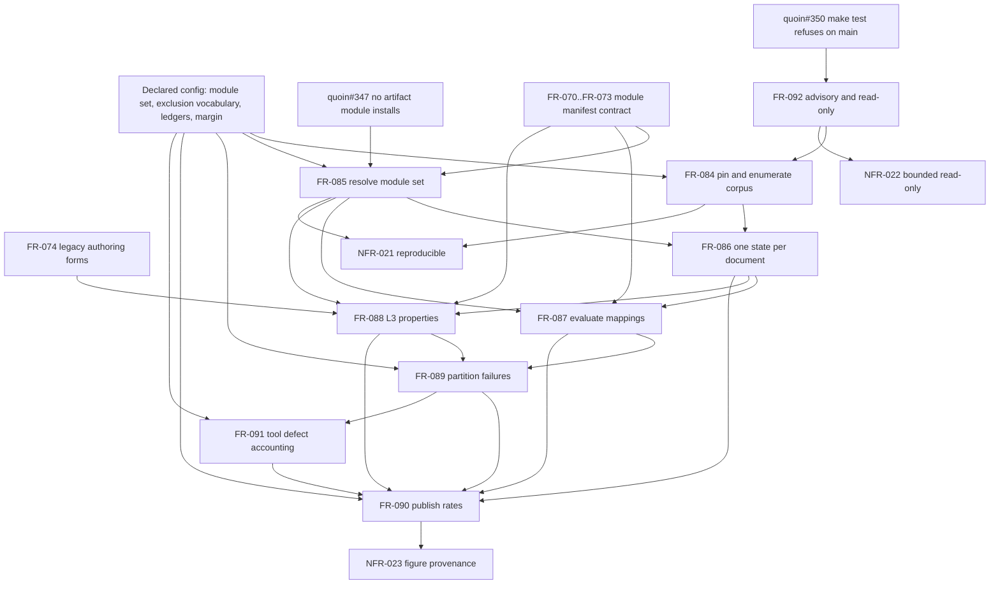

# SR-141: Dependency review of the advisory corpus measurement (quoin#291)

## Summary

The internal graph of FR-084..FR-092 and NFR-021..NFR-023 is acyclic and its
prose reads in a sound order: enumerate the corpus and resolve the module set,
state every document, run the two checks, partition, then publish. Nothing in
the set has to be built twice and no requirement waits on its own output.

The defects are edges that exist in the reasoning but not in the artifacts. The
machine-readable `depends_on` relationships are a strict subset of the prose
`Dependencies` sections, and the prose sections are in turn a strict subset of
the prerequisites the `Inputs` sections name — FR-090 consumes four upstream
record sets and declares one. Five declared configuration inputs (the module
set, the exclusion vocabulary, the classification ledger, the tool-defect
ledger, the divergence margin) are consumed by requirements that no requirement
produces, so the DAG has five dangling roots that a plan would silently skip.

The external side is the sharper problem. Six live blockers bear on this work —
`agent-ix/quoin#347`, `agent-ix/quoin#350`, `agent-ix/quire-rs#402`,
`agent-ix/quire-rs#403`, `agent-ix/spec-artifacts-process#81` and, for
sequencing only, `agent-ix/quoin#349` — and not one of them is named in an FR,
an NFR or a matrix row. FR-085's choice to read modules from the Git object
store is the correct decoupling from `#347`, but the spec does not record that
it *is* a decoupling, so the constraint is one refactor away from being lost.

## Verdict

CONDITIONAL. The ordering is right and no cycle exists, so this is not a
re-architecture. Declare the missing edges — internal, configuration and
external — before this spec is handed to `spec-to-plan`, which consumes the
declared graph and cannot see the prose.

## Findings

| ID | Severity | Summary | Refs | Escape Cause |
| --- | --- | --- | --- | --- |
| FND-1410 | high | No FR, NFR or matrix row names any of the six live blockers, so the work has no declared external prerequisites at all. | FR-084..FR-092; agent-ix/quoin#347; agent-ix/quoin#350 | missing-requirement |
| FND-1411 | medium | FR-090 declares FR-089 as its only upstream while its Inputs consume the records of FR-086, FR-087 and FR-088 — three undeclared prerequisite edges. | FR-090 Inputs; FR-090 Dependencies | wrong-requirement |
| FND-1412 | medium | Frontmatter `depends_on` disagrees with the prose Dependencies in FR-086, FR-087, FR-089, FR-092 and NFR-021, so the graph a tool reads is smaller than the graph the author wrote. | FR-086; FR-087; FR-089; FR-092; NFR-021 | wrong-requirement |
| FND-1413 | medium | Five declared configuration inputs are prerequisites that no requirement produces or owns. | FR-084 Inputs; FR-085 Inputs; FR-089 Inputs; FR-090 Behavior; FR-091 Inputs | missing-requirement |
| FND-1414 | medium | FR-091's rationale asserts four live tool defects but names none, and the tool-defect ledger has no declared seed content. | FR-091 Rationale; FR-091-CON-1 | wrong-requirement |
| FND-1415 | medium | TC-1500..TC-1565 depend on binding that two engine defects and one manifest defect can silently break, and no row or NFR declares that dependency. | TC-1500..TC-1565; agent-ix/quire-rs#403; agent-ix/spec-artifacts-process#81 | correct-requirement-no-evidence |
| FND-1416 | medium | FR-088 declares only FR-074 upstream while consuming the resolved module set and the `measured` state of FR-085 and FR-086. | FR-088 Inputs; FR-088 Dependencies | wrong-requirement |
| FND-1417 | low | FR-092 is declared downstream of FR-084, but the read-only envelope it owns must hold during enumeration — FR-084-CON-1 is FR-092's obligation. | FR-092 Dependencies; FR-084-CON-1; TC-1552 | wrong-requirement |
| FND-1418 | low | The set consumes the semantic-module manifest contract (FR-070, FR-071, FR-073) without declaring an edge to it. | FR-085 Behavior; FR-087 Inputs; FR-088 Inputs | missing-requirement |
| FND-1419 | low | The Downstream halves of FR-084, FR-085, FR-088 and FR-091 are incomplete, so the graph read forward under-reports blast radius. | FR-084 Dependencies; FR-085 Dependencies; FR-088 Dependencies; FR-091 Dependencies | wrong-requirement |

## Findings in detail

### FND-1410 — the blockers are absent from the spec

`agent-ix/quoin#347` says Quoin's semantic-contract validator resolves
`semantic.exports` against `object_types` only, so no artifact-type module can
be installed at all. That removes the installed-catalog route US-022's Options
section raises, and it is the reason FR-085 reads each module from its
repository's object store instead. FR-085 states the *behaviour* and not the
*reason*, so nothing stops a later implementer from "simplifying" onto
`quoin module install` and re-blocking the measurement.

`agent-ix/quoin#350` refuses `make test` on `main` before any test runs,
because the verification stack pins a `quire-rs` revision Track A Wave 4 has
moved past. Every one of TC-1500..TC-1565 runs behind that gate. It is a
prerequisite of executing this ticket's tests, not of designing them.

`agent-ix/quoin#349` is the weakest of the six and belongs in sequencing rather
than in a requirement: it is the precedent that a guard built from
`origin/main...HEAD` passes vacuously post-merge. FR-092-AC-2 compares Git
status before and after a run and must not be built the same way.

Recommendation: give FR-085 a Dependencies note citing `#347` as the reason for
the object-store read, and record `#350` as an execution prerequisite of the
matrix rows.

### FND-1411, FND-1412, FND-1416, FND-1419 — the declared graph is smaller than the real one

Three layers disagree, each smaller than the last:

| Requirement | `depends_on` relationship | Prose Dependencies upstream | Prerequisites its Inputs name |
| --- | --- | --- | --- |
| FR-086 | FR-084 | FR-084, FR-085 | FR-084, FR-085 |
| FR-087 | FR-086 | FR-085, FR-086 | FR-085, FR-086 |
| FR-088 | FR-074 | FR-074 | FR-074, FR-085, FR-086 |
| FR-089 | FR-087 | FR-087, FR-088 | FR-087, FR-088 |
| FR-090 | FR-089 | FR-089 | FR-086, FR-087, FR-088, FR-089 |
| FR-092 | none | FR-084 | FR-084 |
| NFR-021 | constrains FR-084, FR-090 | FR-084, FR-085 | FR-084, FR-085 |

`spec-to-plan` consumes the declared graph. Left as authored, it would place
FR-090 in the same wave as FR-086 and FR-087, and FR-088 in a wave before the
module set it reads exists.

The reverse direction is incomplete for the same reason: FR-084 lists only
FR-086 downstream though FR-092 and NFR-021 both declare it upstream, FR-085
lists only FR-087 though FR-086, FR-088 and NFR-021 consume it, and FR-088 and
FR-091 list no downstream at all though FR-089 and FR-090 consume both.

### FND-1413 — five prerequisites nobody produces

The set consumes, as declared inputs, a module set with a revision per module
(FR-085), an exclusion vocabulary (FR-084), a classification ledger (FR-089), a
tool-defect ledger (FR-091) and a divergence margin (FR-090). Each is an
authored artifact with content, each has to exist before the requirement that
reads it can be exercised, and none is the output of any requirement in the
set. They are enablement work of exactly the kind this analysis exists to hoist
in front of feature work, and today they are invisible to it.

The classification and tool-defect ledgers are the load-bearing pair: the
campaign's exit condition is that every failure carries an owner and a
disposition, and both live entirely in ledger content.

### FND-1414, FND-1415 — the tool defects that bear on the measurement

FR-091's rationale says "Four such defects are known to be live while this
measurement runs" and names none of them, while FR-091-CON-1 requires every
ledger entry to cite a repository and issue number. The requirement demands of
its data precisely what its own rationale omits.

The live set, as of this review:

| Defect | Effect on this work |
| --- | --- |
| `agent-ix/quoin#347` | No artifact-type module installs. Removes the catalog route (FND-1410). |
| `agent-ix/quire-rs#403` | The TypeScript binder counts braces inside regex literals, so one regex makes every trace tag in a file bind nothing. Quoin's suite is TypeScript, so TC-1500..TC-1565 can read green while binding zero rows. |
| `agent-ix/spec-artifacts-process#81` | `traceability.status.column` is `Status` while three TestMatrix coverage tables assert `Coverage Status`, so the status-lie check has never run over FR, StR or US coverage — the check that would catch a `✅` on an unbacked row. |
| `agent-ix/quire-rs#402` | `quire coverage` does not expand `A..B` ranges. Low exposure here: all 66 new rows use comma lists, not ranges. Declaring it keeps that a checked property rather than an accident. |
| `agent-ix/quoin#350` | `make test` refuses on `main` (FND-1410). |

The first three, at minimum, belong in the tool-defect ledger's seed content,
because they are exactly the "check could not run" cases FR-091 was written to
keep out of `pass` and `fail`. The middle two also bear on this ticket's own
matrix, which is the point of FND-1415: the 66 rows are all `🚧` today, so
nothing is currently misreported, but the first row to be marked `✅` will be
marked under a binder that can silently bind nothing.

### FND-1417 — the safety envelope precedes the thing it protects

FR-092 declares FR-084 upstream, and read as an ordering that is backwards for
its constraints: FR-084-CON-1 ("enumeration SHALL NOT write") and
FR-087-CON-2 ("mapping evaluation SHALL NOT rewrite") are obligations FR-092
owns and TC-1552 verifies in one row. The read-only envelope and the output
directory refusal have to be in place the first time enumeration runs over the
real corpus, not after it. FR-092's *reporting* obligations (exit status, run
manifest digests) genuinely do follow FR-084. Splitting the two, or noting that
the envelope is co-requisite, removes the inversion.

### FND-1418 — the cross-wave contract edge

FR-085 reads each module's manifest, JSON Schemas and mappings declaration by
digest, FR-087 evaluates the mapping kinds that declaration names, and FR-088
resolves types against declared object types, enumerations and kernel scalars.
Those surfaces are defined by FR-070, FR-071 and FR-073. FR-088 declares FR-074
and the others declare nothing, so the measurement's dependency on the manifest
contract it measures against is undeclared.

## Classification

| Requirement | Class | Rationale |
| --- | --- | --- |
| FR-084 | Enablement | Produces the population every later requirement counts over. No published behaviour of its own. |
| FR-085 | Enablement | Produces the module set, schemas and mappings the two checks read. |
| FR-092 | Enablement | The read-only, advisory envelope every other requirement runs inside. See FND-1417. |
| FR-086 | Feature | Assigns the state the campaign's first acceptance criterion is stated in. |
| FR-087 | Feature | The mapping check the promotion gate consumes. |
| FR-088 | Feature | The L3 representation check, the only signal about the nine object-type modules. |
| FR-089 | Feature | The partition, owner and disposition the campaign exits on. |
| FR-090 | Feature | The published report and its breakdowns. |
| FR-091 | Feature | The declared tool-defect accounting and its coverage statement. |
| NFR-021 | Enablement | Reproducibility is a property of the harness and constrains its construction. |
| NFR-022 | Enablement | Run-time and read-only bounds constrain the harness, not a published behaviour. |
| NFR-023 | Feature | A property of the published report, verifiable only once the report exists. |

Enablement before feature holds: FR-084, FR-085 and FR-092 with NFR-021 and
NFR-022 precede every feature requirement that depends on them.

## Dependency Graph

The edges below are the union of the declared relationships, the prose
Dependencies and the prerequisites the Inputs sections name — that is, the
graph after the fixes in FND-1411, FND-1412, FND-1416 and FND-1418.

The `FR-092 --> FR-084` edge is the corrected direction of FND-1417 for the
envelope obligations. The reporting obligations of FR-092 (exit status, run
manifest) follow FR-084 and are the reverse edge the artifact declares today.

## Topological Order

1. Declared configuration and the external prerequisites: the module set with
   its revisions, the exclusion vocabulary, the classification ledger, the
   tool-defect ledger seeded with `#347`, `#403` and `spec-artifacts-process#81`,
   the divergence margin, and `quoin#350` cleared so `make test` runs.
2. FR-092 envelope half, with NFR-022 — read-only opening and output-directory
   refusal, in place before the first run over the real corpus.
3. FR-084 and FR-085, parallelizable. Neither reads the other.
4. FR-086. Needs both.
5. FR-087 and FR-088, parallelizable. Both read FR-085 and FR-086 and nothing
   of each other.
6. FR-089, then FR-091. FR-091 classifies into FR-089's partition.
7. FR-090, then NFR-023. FR-090 reads FR-086, FR-087, FR-088, FR-089 and
   FR-091. NFR-023 checks figures that only exist once FR-090 prints them.
8. NFR-021 verified last over the whole run, though its ordering-key obligation
   constrains every emitter from step 3 onward.

## Cycles

None detected, in the declared graph or in the corrected union graph above.

## Execution boundary

This ticket owns the measurement harness, its declared configuration, and the
report. It does not own a fix to any cited defect, a change to any module's
declared schemas or mappings, or any edit to a corpus repository — a
`contract-defect` classification under FR-089 records a finding and hands it to
the module's own repository. It does not own promotion of any module contract
from advisory to enforcing, nor the later normalization campaign that consumes
the partition.
