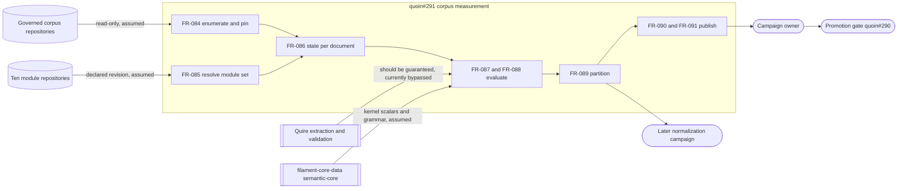

# SR-147: Scope-boundary review of the quoin#291 advisory corpus measurement

## Summary

Thirteen artifacts were reviewed: US-022, FR-084..FR-092 and NFR-021..NFR-023, the
set added by commit `2e5d704` for `agent-ix/quoin#291`. The review asks one
question — does each requirement sit in the component the epic `agent-ix/quoin#286`
says owns it, and does the measurement re-derive anything Quire or a module already
owns.

The campaign's own boundaries hold well. The measurement is read-only over the
corpus (FR-092), it never edits a corpus repository, it exits zero whatever it finds,
and it hands normalization forward as a `deferred-corpus-fix` disposition naming a
later campaign (FR-089). The reporting requirements (FR-090, FR-091, NFR-023) keep
the census honest without taking any decision that belongs to `agent-ix/quoin#290`.

The boundary that does not hold is the measurement's own evaluator. FR-087 and
FR-088 build, inside Quoin, a Markdown-mapping evaluator, a record-to-JSON-Schema
validator, an L3 Properties classifier, a `Type`-token resolver, a multiplicity
grammar and a constraint-keyword checker. Every one of those is already allocated:
FR-071..FR-074 publish them as the mapping contract that Quire implements, and
`agent-ix/quire-rs#388` — closed — implements them. FR-073 states in terms that
"Quire SHALL validate ... the archetype's extracted record against the referenced
`<Name>.json`". A second evaluator would not merely duplicate work; it would publish
a corpus rate measured by a checker that is not the checker the promotion gate is
being asked to promote, which is the one number this campaign exists to produce.

## Verdict

CONDITIONAL. The advisory/normalization boundary and the read-only boundary are
sound and need no change. FND-1470, FND-1471 and FND-1472 must be resolved before
these requirements are tasked, because each one relocates a rule the module or Quire
owns into the measurement and each one changes the published figure. FND-1473..
FND-1477 should be fixed while the statements are cheap to edit. FND-1478 and
FND-1479 are advisory.

## System Context

## In-Scope Responsibilities

- Name and pin the population: repositories, revisions, cleanliness, document counts (FR-084).
- Name and pin the contract under measurement: module revisions and contract-surface digests (FR-085).
- Give every document exactly one explicit disposition, `unknown` included (FR-086).
- Run the declared checks over that population and record their outcomes verbatim (FR-087, FR-088).
- Attach an owner and a disposition to every failure, and refuse to invent either (FR-089).
- Publish every figure with its unit, population, method and partitions (FR-090, NFR-023).
- Account for known tool defects as cited, non-verdict states (FR-091).
- Stay advisory, read-only, reproducible and bounded (FR-092, NFR-021, NFR-022).

## Out of Scope

- Deciding promotion, publishing packages, or moving a catalog pin — `agent-ix/quoin#290`.
- Editing, normalizing or migrating any corpus document — the later normalization campaign.
- Defining, weakening or strengthening any module constraint — the module repositories.
- Parsing fenced clause content — `agent-ix/quire-contract-ir#52` (FR-072-CON-1).

## External Dependencies

| Dependency | Type | Assumed or Guaranteed | Contract |
| --- | --- | --- | --- |
| Governed corpus repositories | Filesystem, read-only | Assumed | FR-084 enumeration rules; FR-092-CON-1 |
| Module repositories at declared revisions | Git object store | Assumed | FR-085; module `semantic` block, FR-070 |
| Module JSON Schemas | JSON Schema 2020-12 | Assumed | FR-073 path plus digest — digest not re-verified, see FND-1476 |
| Quire extraction and validation | Library or CLI | Unallocated — should be guaranteed | `agent-ix/quire-rs#388`; Quoin's vendored Quire JSON contract, FR-029 |
| semantic-core kernel scalars and grammar | Vendored schema bundle | Assumed | `agent-ix/filament-core-data#35`; FR-071 cell grammars |
| Tool-defect ledger | Declared input | Guaranteed | FR-091-AC-1 refusal of an uncited entry |
| Classification ledger | Declared input | Guaranteed | FR-089-AC-2..AC-6 refusals |

## Responsibility Allocation

| Requirement | Owning Component | Class |
| --- | --- | --- |
| US-022 | quoin#291 measurement | core |
| FR-084 | quoin#291 measurement | core |
| FR-085 | quoin#291 measurement (module reading belongs to Quoin's catalog reader) | infrastructure |
| FR-086 | Quoin catalog type resolution (FR-010, FR-012) | core |
| FR-087 | Quire extraction and validation — currently allocated to the measurement | core |
| FR-088 | Quire L3 extraction (FR-071, FR-074) — currently allocated to the measurement | core |
| FR-089 | quoin#291 measurement | core |
| FR-090 | quoin#291 measurement | cross-cutting |
| FR-091 | quoin#291 measurement | cross-cutting |
| FR-092 | quoin#291 measurement | cross-cutting |
| NFR-021 | quoin#291 measurement | cross-cutting |
| NFR-022 | quoin#291 measurement | cross-cutting |
| NFR-023 | quoin#291 measurement | cross-cutting |

Three rows do not resolve to one owner as written: FR-086, FR-087 and FR-088 each
name the measurement as the actor for a rule another component already owns. Those
are FND-1477, FND-1470 and FND-1471.

## Findings

| ID | Severity | Summary | Refs |
| --- | --- | --- | --- |
| FND-1470 | high | FR-087 builds a Quoin-side evaluator for nine mapping kinds and validates the built record against the module's JSON Schema, work FR-073 assigns to Quire and `agent-ix/quire-rs#388` (closed) implements; the epic forbids parallel replacements, and a rate measured by a second checker does not describe the checker #290 is asked to promote. | FR-087, FR-073, FR-071 |
| FND-1471 | high | FR-088 re-derives the L3 Properties classifier, the five representation forms, the `Type` resolver, the multiplicity forms and the constraint vocabulary inside the measurement, all of which FR-071 and FR-074 publish as the mapping Quire implements; the measurement should consume Quire's extraction record and its `semantic.legacy-properties-form` diagnostics rather than re-classify. | FR-088, FR-074, FR-071 |
| FND-1472 | high | FR-088 assigns severities the contract owner does not: FR-071 makes an unresolved `Type` token an advisory finding carrying a placeholder identity, while FR-088-AC-3 makes it `fail`; deciding strictness belongs to the module and to Quire, and doing it here inflates the failure count the promotion gate consumes. | FR-088, FR-071 |
| FND-1473 | medium | FR-088-CON-2 declares the closed constraint-keyword vocabulary to be "the one the resolved module set declares"; per FR-070 and FR-071 that vocabulary and the kernel scalars are owned by the Quoin mapping contract and by semantic-core (`agent-ix/filament-core-data#35`), not by per-module declarations, so the constraint as written both misallocates ownership and cannot be satisfied. | FR-088, FR-071, FR-070 |
| FND-1474 | medium | FR-089 admits the disposition `contract-fix-this-campaign` without allocating the fix to the owning module repository or requiring that repository's agreement, and without restating the epic's rule that no constraint is weakened to make the corpus green; module repositories own their vocabulary and constraints. | FR-089 |
| FND-1475 | medium | FR-089's `accepted` disposition duplicates the exception ledger of `agent-ix/quoin#290` while omitting that gate's required expiry or review condition and its recorded human acceptor, and no requirement in the set states that the promote/hold decision and any catalog-pin change are out of scope here. | FR-089, FR-090 |
| FND-1476 | medium | FR-085 stands up a second module reader — git object-store reads, manifest and type parsing, digesting — beside Quoin's own FR-006..FR-009 and FR-070 install-time reader, and never compares a recorded schema digest with the `data_schema` digest the module declares under FR-073, so the census can be measured against a schema the module does not claim. | FR-085, FR-073, FR-070 |
| FND-1477 | medium | FR-086 re-specifies type-to-module resolution and multi-module type collision, which Quoin already owns in FR-010 and FR-012, and is silent on case sensitivity while FR-071 requires case-sensitive `Type` resolution; two resolution rules now exist in one system with no stated relationship. | FR-086, FR-010, FR-012, FR-071 |
| FND-1478 | low | FR-087 lists `ocl-clause` and `sysml-fence` among the mapping kinds the measurement evaluates without carrying FR-072-CON-1's prohibition forward, leaving the door open to clause parsing inside Quoin; state that evaluation is extraction-level only — clause id, language and span. | FR-087, FR-072 |
| FND-1479 | low | The `agent-ix/quoin#291` acceptance criterion requires the final report to pin corpus, module, compiler and schema revisions, but no requirement records the semantic-core or compiler version in force, and FR-084 defines the governed corpus by a local workspace heuristic without relating it to the corpus named in the ticket's own dependency, `agent-ix/quire-rs#385`. | FR-084, FR-085, FR-090 |

## Recommendations

- Recast FR-087 and FR-088 as consumers: the measurement drives Quire over each
  document at the declared module revisions and records Quire's outcome, locus and
  severity unchanged. Everything the two requirements say about ordering, states,
  populations and completeness survives that change; only the evaluator moves.
- Where Quire cannot yet run a declared mapping, that is a `could-not-run` with the
  citation FR-091 already requires, not a reason to build a second evaluator.
- Add one constraint to FR-089 allocating every `contract-fix-this-campaign` to an
  issue in the owning module repository, and one statement placing the promote/hold
  decision, the exception ledger's expiry conditions and catalog pins in
  `agent-ix/quoin#290`.
- Record the semantic-core version and the Quire version beside the module and
  corpus pins, so the report names every component whose behavior produced a figure.

## Evidence

Reviewed at commit `2e5d704` on branch `spec/291-corpus-measurement`. Ownership
rules read from `agent-ix/quoin#286` (Ownership rules, Mandatory disruption
controls), the ticket text of `agent-ix/quoin#291` and `agent-ix/quoin#290`, and the
closed `agent-ix/quire-rs#388` (L3 extraction deliverables, 2026-09-03). In-repo
allocation read from FR-070, FR-071, FR-072, FR-073 and FR-074, which name Quire as
the implementer of the mappings and of record-versus-schema validation, and from
FR-010 and FR-012, which already own type lookup and duplicate-type detection.
