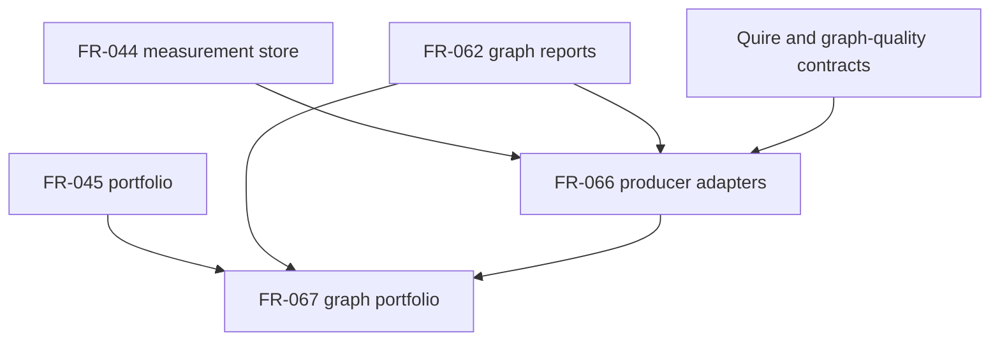

# Dependency review of Quoin #281 graph portfolio requirements

## Summary

The dependency graph is acyclic. FR-066 is enablement over existing FR-044 and
producer contracts; FR-067 is the user-visible feature over FR-045, FR-062, and
FR-066.

## Findings

| ID | Severity | Summary | Refs |
| --- | --- | --- | --- |
| FND-001 | low | No dependency cycle or ordering ambiguity was found | FR-066, FR-067 |

## Classification

| Requirement | Class | Rationale |
| --- | --- | --- |
| StR-007 | Feature | States the stakeholder-visible evidence-review outcome |
| FR-066 | Enablement | Validates and normalizes retained producer contracts for storage/consumption |
| FR-067 | Feature | Extends the operator-visible portfolio report |

## Dependency Graph

## Topological Order

1. Existing FR-044/FR-045 and contract-fixture seams.
2. FR-066 adapter validation and normalized collection construction.
3. FR-067 pure portfolio logic, then concrete FR-062 wiring when its export is stable.

The quire-code-rs producer implementation is not a Quoin landing blocker:
Quoin verifies the declared contract with retained fixtures and runs no producer.
