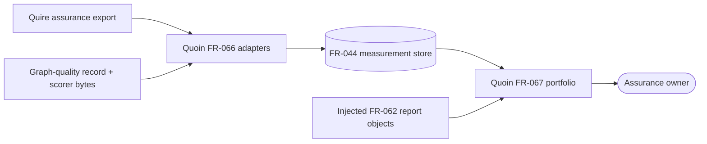

# Scope and boundary review of Quoin #281 graph portfolio requirements

## Summary

Quoin owns validation, transcription, retained-store reading, compatibility,
and presentation. Producer execution, graph semantics, scoring, thresholds,
and verdict policy remain outside this ticket and outside this repository lane.

## Findings

| ID | Severity | Summary | Refs |
| --- | --- | --- | --- |
| FND-001 | low | No unresolved ownership or external-boundary ambiguity remains | StR-007, FR-066, FR-067 |

## System Context

## External Dependencies

| Dependency | Assumed or Guaranteed | Contract |
| --- | --- | --- |
| Quire assurance producer | Guaranteed on intake | Caller-supplied accepted premise tuple plus Quire FR-067/068 fixture contract |
| Graph-quality producer | Guaranteed on intake | `graph-quality-observation-v1`, canonical id, scorer digest |
| FR-062 analysis | Guaranteed through integration tests after stable export | Quoin #152 exported report interface; #281 does not define a competing graph model |

## Responsibility Allocation

| Requirement | Owner | Class |
| --- | --- | --- |
| StR-007 | Quoin measurement/report subsystem | core |
| FR-066 | `src/measurement` adapter boundary | infrastructure |
| FR-067 | `src/measurement` portfolio/report boundary | core |

Out of scope: Quoin #286, any Filament repository, `agent-skills`, producer
execution, quire-code-rs implementation, and graph traversal/reconstruction.
