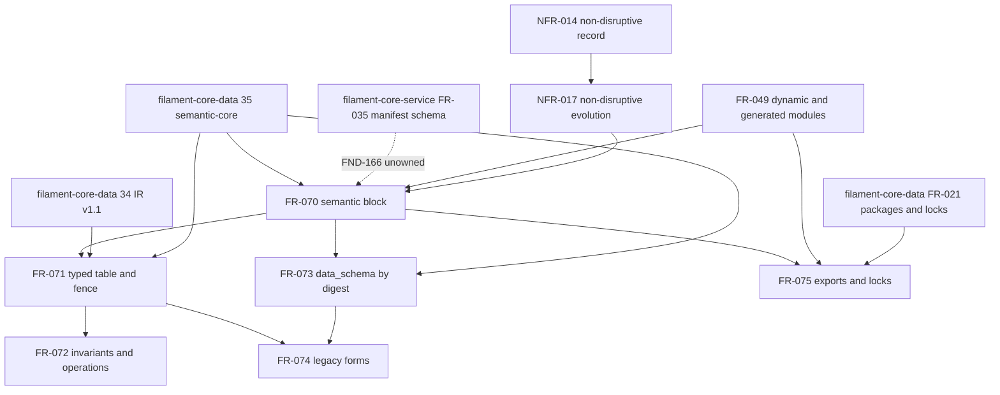

# Dependency review of issue 293 semantic module contract requirements

## Summary

The slice is acyclic inside quoin: FR-070 is the single enablement root, FR-071 and FR-073
hang off it, and FR-072, FR-074, FR-075 are the features behind them. The external
prerequisites it names (`filament-core-data#34`, `#35`, FR-021, FR-029, FR-031, FR-033,
quoin FR-049) are merged or already specified. Four prerequisites it does not name are the
findings: the `module-manifest.schema.json` change has no owner and exists in three divergent
copies, "the loader" is two loaders in two repositories, the semantic-core schema bundle is
private until `filament-core-data#11`, and two downstream tickets (#287 lock, #291 sweep
report) supply artifacts that FR-074 and FR-075 acceptance criteria read.

## Findings

| ID | Severity | Summary | Refs |
| --- | --- | --- | --- |
| FND-166 | high | `module-manifest.schema.json` has three divergent copies (filament-core-service `spec/schemas` under FR-035 carries `nav`; `spec-artifacts-iso` carries the registry entries; quoin and quire-rs `corpus/` mirror the latter), every one with top-level `additionalProperties: false`, so a `semantic` block is rejected by all of them today; FR-070-CON-2 requires "the" schema to publish the block but names no owner and no dependency on filament-core-service FR-035. | FR-070-CON-2; FR-070-AC-3; NFR-017-AC-4; TC-1342; TC-1343; TC-1382 |
| FND-167 | medium | FR-070, FR-073, FR-074 say "the loader" but two loaders read `manifest.yaml`: quoin `src/catalog.ts` (FR-009) and quire-rs `src/loader/manifest.rs`, whose top-level `Manifest` has no `deny_unknown_fields` and silently drops a `semantic` key; the FRs allocate no rejection to quoin versus `quire-rs#388` and FR-009 is absent from FR-070's upstream list. | FR-070; FR-073; FR-074; FR-009; TC-1336..TC-1341 |
| FND-168 | medium | semantic-core `0.1.0` is private until `filament-core-data#11`; FR-071-AC-1, FR-073-AC-1 and FR-073-AC-3 validate against `FieldDecl.json` and the semantic-core bundle while FR-073-CON-1 forbids network reads, so a vendored schema bundle or fixture copy is an unnamed prerequisite of the first test. | FR-071-AC-1; FR-073-AC-1; FR-073-AC-3; FR-073-CON-1; TC-1344; TC-1360; TC-1362 |
| FND-169 | medium | FR-075 writes digests into "the catalog lock" and fails `quoin install` on a missing import, but the lock is the deliverable of `quoin#287`, which FR-075 lists as downstream; FR-075-AC-2 and AC-3 cannot execute before #287 fixes the lock shape, so the edge is inverted or a lock-schema enablement is missing. | FR-075-AC-2; FR-075-AC-3; TC-1373; TC-1374; FR-019 |
| FND-170 | medium | FR-074's promotion guard reads a "recorded advisory sweep report" whose identity and location `quoin#291` (listed downstream) defines; FR-074-AC-3 and NFR-017-AC-2 therefore depend on #291 output while #291 depends on FR-074 diagnostics, a soft cycle that needs the report's path or id fixed here. | FR-074-AC-3; NFR-017-AC-2; TC-1369; TC-1380 |
| FND-171 | low | FR-070 `targets` cites "the filament-core-data declared target registry" with no FR id, and FR-072's external `clause: <path>` reference form is defined by no upstream requirement; the FR-029, FR-031, FR-033, FR-021 citations resolve to the titles claimed. | FR-070; FR-072-AC-6; TC-1358 |
| FND-172 | low | The quoin-internal graph is acyclic and enablement-first: FR-049 and US-013 precede FR-070; FR-070 precedes FR-071, FR-073, FR-075; FR-071 precedes FR-072 and FR-074; NFR-014 precedes NFR-017. | FR-070..FR-075; NFR-017 |

## Classification

| Requirement | Class | Rationale |
| --- | --- | --- |
| FR-070 | Enablement | The `semantic` block is the schema every other requirement reads; no behaviour on its own |
| FR-071 | Enablement | Mapping contract and golden fixtures that `quire-rs#388` consumes unchanged |
| FR-072 | Feature | Invariant and operation extraction visible to authors; depends on FR-071 |
| FR-073 | Feature | Digest-checked `data_schema` loading; depends on FR-070 and the semantic-core bundle |
| FR-074 | Feature | Legacy-form warnings and promotion guard; depends on FR-071, FR-073 |
| FR-075 | Feature | Derived package manifest and lock entries; depends on FR-070, FR-049, FR-021 |
| NFR-017 | Enablement | Disruption gate constraining every FR; depends on NFR-014 |

## Dependency Graph

## Topological Order

1. Resolve FND-166: assign the `module-manifest.schema.json` owner and land the `semantic`
   block in that copy; vendor the semantic-core `0.1.0` schema bundle for tests (FND-168).
2. FR-070 with NFR-017 gates in force (enablement).
3. FR-071 and FR-073 (parallel after FR-070); FR-075 declaration surface after FR-070 but
   its lock acceptance criteria wait for `quoin#287` (FND-169).
4. FR-072 and FR-074 (parallel after FR-071; FR-074 also after FR-073).
5. `quire-rs#388` consumes FR-071 fixtures; `quoin#291` runs the sweep whose report FR-074's
   promotion guard reads (FND-170); `quoin#290` and `quoin#292` follow.

## Cycles

None inside the slice. Two soft cycles cross the ticket boundary: FR-074 ↔ `quoin#291`
(FND-170) and FR-075 ↔ `quoin#287` (FND-169).
