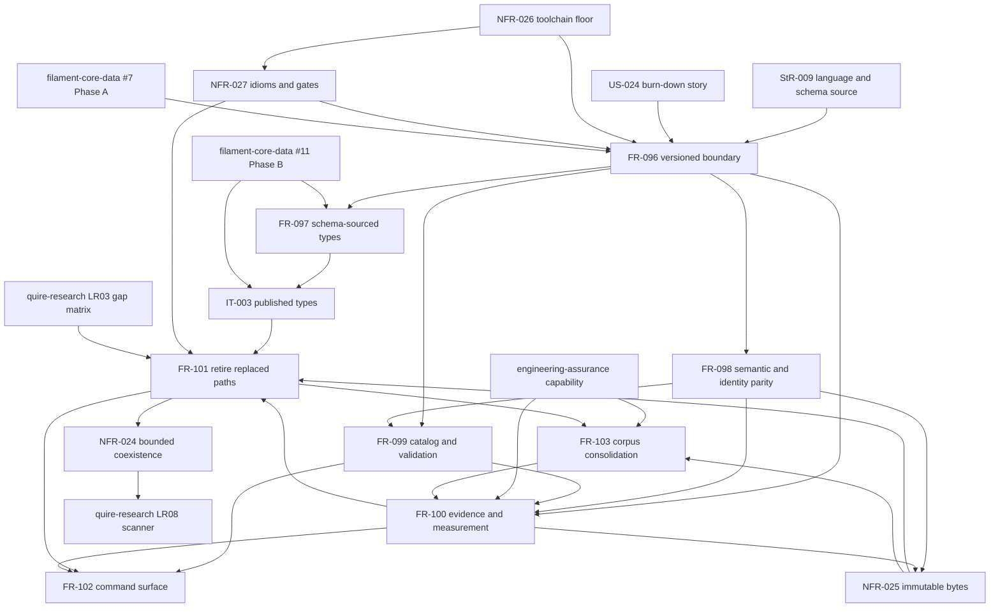

# Dependency review of the EPIC 373 Rust burn-down spec set

## Summary

This analysis derives the prerequisite graph over the EPIC #373 artifact batch — ADR-0003,
StR-009, US-024, FR-096 through FR-103, NFR-024 through NFR-027, and IT-003 — from each
artifact's frontmatter `relationships`, its `## Dependencies` section, and the acceptance
criteria that name another artifact's output. The graph is **not acyclic as authored**: one
three-node cycle exists between FR-100, FR-101 and FR-103, and a second ordering inversion
places the dependency-cycle-break work inside FR-101 while FR-100-AC-1 requires it as a
precondition. Three further high findings concern enablement misplaced downstream (NFR-024),
external-gate granularity (the `filament-core-data` Phase A/Phase B split against FR-097 and
IT-003), and an undeclared hard prerequisite on `engineering-assurance` that ADR-0003
explicitly denies. The machine-readable edge set in frontmatter also disagrees with the prose
dependency set in five artifacts, so a planner consuming `relationships` derives a different
DAG from the one the documents describe.

## Findings

| ID | Severity | Summary | Refs |
| --- | --- | --- | --- |
| FND-001 | high | Prerequisite cycle FR-100 → FR-101 → FR-103 → FR-100: FR-101 declares FR-100 upstream, FR-103 declares FR-101 upstream, and FR-103 declares FR-100 downstream and requires consolidation to complete before the measurement crates are ported. | FR-100 Dependencies; FR-101 Dependencies; FR-103 frontmatter `requires FR-101`, Behavior, Dependencies |
| FND-002 | high | Ordering inversion on the dependency-cycle break: FR-100-AC-1 requires both TypeScript cycles absent *before the first domain crate is added*, but the obligation to break them as behaviour-preserving refactors of the retained TypeScript is carried by FR-101, which declares FR-100 upstream. The precondition is topologically after the requirement that consumes it, and the same work is stated twice. | FR-100 Behavior, FR-100-AC-1; FR-101 Behavior, FR-101-AC-7 |
| FND-003 | high | NFR-024 is enablement declared downstream. It alone defines `.language-allowances.yaml` and what a valid successor reference is, and FR-100-AC-7, FR-101-AC-8 and FR-103-AC-5 all consume that manifest — yet NFR-024 declares FR-101 as upstream. The edge must run NFR-024 → FR-101/FR-103, and the manifest must be tasked before the first retention is recorded. | NFR-024 Statement, Verification, Dependencies; FR-100-AC-7; FR-101-AC-8; FR-103-AC-5 |
| FND-004 | high | FR-097 mixes Phase-A and Phase-B work in one requirement. ADR-0003 gates only *type retirement* on `filament-core-data` #11 (Phase B) and releases stages 0–3 on #7 (Phase A), but FR-097 carries generation, provenance and staleness (stage 0) in the same requirement as duplicate retirement, so the Phase B gate blocks every stage-0–3 requirement that crosses the generated type surface. | ADR-0003 § Gate; FR-097 Behavior, FR-097-AC-1..AC-5, Dependencies |
| FND-005 | high | IT-003 is declared a prerequisite of all of FR-101 ("the type-retirement work under FR-101, which may not begin before this boundary holds"), which extends the Phase B gate from type retirement to the whole retirement requirement and contradicts ADR-0003's scoping of Phase B. IT-003 also cannot run at all today — `filament-core-data` publishes nothing. | ADR-0003 § Gate; IT-003 Preconditions, Notes, Dependencies; FR-101 |
| FND-006 | high | `engineering-assurance` supply is an unstated hard prerequisite. FR-100 forbids implementing shared assurance capability locally and FR-103-AC-4 requires corpus accounting to be obtained from `engineering-assurance` with no local implementation existing — while ADR-0003 declares `engineering-assurance` "a reference, not a dependency". No gate, revision pin, or ordering for the gap-ticket fallback is declared, so FR-103-AC-4 is unsatisfiable until an unowned external delivers. | ADR-0003 § Crate topology, § Capability boundary; FR-100 Behavior, FR-100-CON-2; FR-103 Behavior, FR-103-AC-4 |
| FND-007 | medium | Frontmatter `relationships` and prose `## Dependencies` declare different edge sets, so the machine-derived DAG is not the authored one. FR-100 omits FR-099, FR-102 omits FR-100, NFR-026 omits NFR-020, FR-099 omits FR-007/FR-017/FR-029, FR-103 omits FR-084, and NFR-027 omits NFR-026. | FR-099, FR-100, FR-102, FR-103 frontmatter vs Dependencies; NFR-026, NFR-027 frontmatter vs Dependencies |
| FND-008 | medium | Constraint edges have no declared direction convention and are stated bidirectionally: FR-101 names NFR-024 and NFR-025 as downstream while both NFRs name FR-101 as downstream. A topological sort cannot resolve which side is the prerequisite. | FR-101 Dependencies; NFR-024 Dependencies; NFR-025 Dependencies |
| FND-009 | medium | ADR-0003 states corpus consolidation "runs in parallel and independently", but FR-103 declares FR-101 upstream and requires consolidation to complete before the measurement crates (delivery stage 6) are ported. The ADR's parallel-track claim and FR-103's serial edges cannot both hold. | ADR-0003 § Port and cutover order; FR-103 Behavior, Dependencies |
| FND-010 | medium | The toolchain floor is a cross-repository prerequisite with no resolution owner. NFR-026 declares 1.98.1 while `quire-rs` and `filament-core-data` pin 1.94.1, and FR-099 takes a Cargo edge to `quire-rs`; NFR-026-AC-4 only requires the disagreement be *reported*, which does not unblock the edge it constrains. | ADR-0003 § Open questions; NFR-026 Rationale, NFR-026-AC-4; FR-099 Behavior |
| FND-011 | medium | quire-research LR03 and LR08 are prerequisites carried with no pinned identity or gate. LR03's capability-gap matrix is a declared *input* to FR-101, and LR08's enforcement scanner is what produces the metric NFR-024 specifies and what StR-009-VC-2 and VC-5 are validated by — so two of the stakeholder need's validation criteria are satisfiable only by an artifact this repository does not own. | StR-009-VC-2, StR-009-VC-5; FR-101 Inputs; NFR-024 Dependencies |
| FND-012 | medium | `skills/**/workflow-assets/**` has no prerequisite edge to the requirement that consumes it. FR-099 and FR-101 both require a recorded disposition for each asset, ADR-0003 defers that disposition to delivery stage 8 (the command residue), and FR-102 conditions the oclif retirement on "every logic capability behind it is Rust-native" — but FR-102 declares no dependency covering the workflow-assets disposition. | ADR-0003 § Capability boundary; FR-099 Behavior, FR-099-AC-9; FR-101 Behavior; FR-102 Behavior, Dependencies |
| FND-013 | low | No requirement in this batch owns the creation of delivery-stage tickets 0–9, yet NFR-024-AC-1 requires every retained path to name an open sub-issue of the burn-down epic naming its stage. Until those tickets exist the entire retained surface classifies as violations rather than retentions, which is an unowned prerequisite of the metric's opening value. | ADR-0003 § Open questions; NFR-024 Rationale, NFR-024-AC-1, NFR-024-AC-2 |

## Classification

| Requirement | Class | Rationale |
| --- | --- | --- |
| StR-009 | Enablement (need) | States the language and schema-source need; carries no behaviour of its own. |
| US-024 | Enablement (need) | Owner-facing story driving FR-096..FR-103; illustrative, not verifiable. |
| FR-096 | Enablement | The versioned `quoin-core` subprocess boundary. No business-visible behaviour; every other FR crosses it. |
| FR-097 | Enablement | Schema-sourced type surface and the type-surface gate. Mixed-stage — see FND-004. |
| FR-098 | Enablement | Differential harness, digest replay and parity oracle. Produces evidence, not behaviour. |
| FR-099 | Feature | Catalog, module, Quire-adapter and validation behaviour reached through the boundary. |
| FR-100 | Feature | Evidence, change-assurance, audit, assurance and measurement behaviour. |
| FR-101 | Feature | Retirement of replaced executable paths — the programme's visible deliverable. Also carries enablement work (the cycle breaks) that belongs upstream, see FND-002. |
| FR-102 | Feature | Command surface preservation and oclif retirement; user-visible at the CLI. |
| FR-103 | Feature | Quoin-side corpus accounting and selection consolidation. |
| NFR-024 | Enablement | Defines the allowance manifest, the valid-successor rule and the three classification classes the metric is computed from. Misplaced downstream, see FND-003. |
| NFR-025 | Constraint | Immutability guarantee over evidence and accepted-corpus bytes; gates cutover, adds no capability. |
| NFR-026 | Enablement | Declares the toolchain channel every Rust gate runs on; must exist before the first crate builds. |
| NFR-027 | Enablement | Workspace lint, error-type, newtype and tracking-tag gates; must exist before the first crate is reviewed. |
| IT-003 | Verification | Integration test over the published-type boundary; blocked on `filament-core-data` Phase B, see FND-005. |

## Dependency Graph

Solid edges are prerequisites as authored. The edges marked in the cycle note below are the
ones that make the graph non-acyclic.

## Cycles

**One cycle detected.** `FR-100 → FR-101 → FR-103 → FR-100` (FND-001). It is authored, not
inferred: FR-101 declares FR-100 upstream, FR-103 declares FR-101 upstream, and FR-103's
Behavior requires consolidation to complete before the measurement crates FR-100 owns are
ported, with FR-100 named as FR-103's downstream.

Two ways to break it, both requiring an owner decision rather than an editorial fix:

1. **Split FR-103's edge.** The part of FR-103 that FR-100 needs is corpus *accounting and
   selection* resolving to one source; the part that needs FR-101 is the *disposition and
   deletion* of Quoin-side corpus modules. Separating those gives `FR-103a → FR-100 → FR-101 →
   FR-103b` with no cycle. This matches ADR-0003's "corpus consolidation runs in parallel"
   claim and also clears FND-009.
2. **Drop FR-103's FR-101 upstream edge.** FR-101 supplies FR-103 only the general
   retain-cutover-delete lifecycle, which NFR-024 and NFR-025 already constrain directly. If
   that edge is soft it does not belong in the graph at all.

A second, narrower inversion (FND-002) is not a cycle in the declared edge set but is one in
the work: FR-100-AC-1 asserts the two TypeScript dependency cycles are absent *before the
first domain crate is added*, while the obligation to break them sits in FR-101, downstream of
FR-100. Relocating the cycle-break clause to FR-100 — or to a separate stage-0 requirement —
removes the inversion. Note that the defect the cycle break addresses is itself real and
independently recorded: `src/evidence/index.ts:142` re-exports from
`../change-assurance/schema-assets.js` while `src/change-assurance/store.ts:22` imports from
`../evidence/store.js`, and `auditor` and `advisor` import each other.

## Topological Order (suggested implementation sequence)

Valid only after FND-001, FND-002 and FND-003 are resolved as above. Items on one line are
parallelizable.

1. NFR-026 (toolchain floor), NFR-027 (lint, error-type and tracking-tag gates), NFR-024's
   definitional half (`.language-allowances.yaml`, the valid-successor rule, and the
   delivery-stage tickets FND-013 names) — all enablement, none of which depends on a crate
   existing.
2. Cycle-break refactors of the retained TypeScript (evidence↔change-assurance,
   auditor↔advisor), behaviour-preserving. Relocated out of FR-101 per FND-002.
3. FR-096 (boundary) and the generation half of FR-097 (`quoin-schemas`, `src/core/types.ts`,
   provenance, staleness). Released by `filament-core-data` #7 Phase A.
4. FR-098 (differential harness, digest replay, `proptest` ports). Enablement; the parity
   oracle every later cutover consumes.
5. FR-103a — corpus accounting and selection resolving to one source, gated on
   `engineering-assurance` supply (FND-006).
6. FR-099 (Quire adapter, validators first, then semantic and completeness, then config,
   modules and catalog). Stage-parallel per ADR-0003.
7. FR-100 (store, evidence, change assurance, auditor and advisor, assurance, graph analysis,
   then the five measurement crates).
8. NFR-025 gates each store-backed cutover in this band rather than following it.
9. FR-101 (cutover and deletion per capability, deletion always last), with NFR-024's
   reporting half running on every candidate revision.
10. FR-103b — disposition and deletion of Quoin-side corpus modules.
11. IT-003, when `filament-core-data` #11 Phase B closes, followed by FR-097's retirement half.
12. FR-102 (command residue, then `@oclif/core` retirement and the `quoin-core` → `quoin`
    rename). Last, and blocked on the dated extension-contract disposition and on the
    `workflow-assets` disposition FND-012 leaves unedged.

## Enablement and feature separation

The rule is that enablement precedes any feature depending on it. This batch satisfies it for
FR-096, FR-097 and FR-098, which are correctly upstream of every feature. It violates it in
two places: NFR-024 is enablement declared downstream of the feature that consumes it
(FND-003), and the cycle-break refactor is enablement embedded in the last feature in the
chain (FND-002). NFR-026 and NFR-027 are correctly ordered relative to each other but reach
the FR set only as `constrains` edges, which FND-008 shows carry no agreed direction — they
should be prerequisites of FR-096, not constraints on it.

## External gates

| Gate | Owner | Releases | Finding |
| --- | --- | --- | --- |
| `filament-core-data` #7 Phase A | filament-core-data | Delivery stages 0–3 | Blocked in practice by FND-004's mixed-stage FR-097. |
| `filament-core-data` #11 Phase B | filament-core-data | Type retirement only | FND-005: IT-003 extends it to all of FR-101; nothing publishes today. |
| `engineering-assurance` capability | engineering-assurance | FR-100 shared assurance, FR-103 corpus accounting | FND-006: hard prerequisite that ADR-0003 declares is not a dependency. |
| quire-research LR03 | quire-research | FR-101 capability-gap matrix input | FND-011: no pinned identity. |
| quire-research LR08 | quire-research | NFR-024 metric, StR-009-VC-2 and VC-5 | FND-011: stakeholder validation owned outside this repository. |
| Owner ruling on `agent-ix/qa-corpus` scope | repository owner | FR-103 scope | Open; FR-103 is confined to the Quoin side until it lands. |
| Dated owner disposition for the oclif extension contract | repository owner | FR-102 shell replacement | Declared inside FR-102-AC-3; no upstream edge required. |
