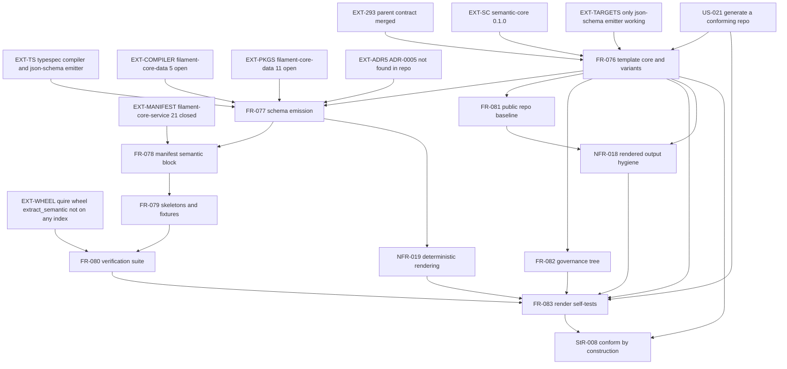

# SR-131: Dependency analysis of the semantic-module cookiecutter

## Summary

This review separates enablement work from feature work across StR-008,
US-021, FR-076 through FR-083, NFR-018, and NFR-019, weighs the external
dependencies named in the task briefing, and orders the requirements into the
sequence a plan should follow. The classification, dependency graph, and
topological order follow below.

### Classification

| Requirement | Class | Rationale |
|---|---|---|
| StR-008 | Feature | The stakeholder-visible outcome: a conforming repository from one template, satisfied_by FR-076 and FR-083 |
| US-021 | Feature | The user story driving FR-076 through FR-083, no independent behavior of its own |
| FR-076 | Enablement | The template core and module_kind switch every other FR renders through, no business-visible output alone |
| FR-077 | Enablement | The schema emission pipeline FR-078 and FR-079 read from, an internal build step |
| FR-078 | Feature | The manifest semantic block a consumer reads, visible contract compliance |
| FR-079 | Feature | The skeletons, mappings and fixtures a maintainer edits and runs, visible authoring surface |
| FR-080 | Feature | The verification suite a maintainer runs and reads a pass or fail from |
| FR-081 | Feature | The public repository and packaging baseline a consumer installs |
| FR-082 | Feature | The spec tree and Test Matrix a maintainer and quire validate see |
| FR-083 | Enablement | Quoin's own render-and-conformance gate, verifies the template itself rather than delivering module behavior |
| NFR-018 | Enablement | A cross-cutting hygiene invariant enforced by FR-083's scan, not a behavior on its own |
| NFR-019 | Enablement | A cross-cutting determinism invariant enforced by FR-083's double-render check, not a behavior on its own |

### External prerequisites weighed

| Node | State | Bears on |
|---|---|---|
| EXT-293 | quoin#293 merged as 3e842ce, CLOSED | Parent contract for FR-070..FR-075, which US-021 assumes settled |
| EXT-289 | quoin#289 CLOSED | Named as blocked-on in this task's briefing but already resolved, not a current blocker |
| EXT-SC | agent-ix/semantic-core 0.1.0 published on npm.ix, confirmed by npm view | FR-076, FR-077 |
| EXT-TS | @typespec/compiler and @typespec/json-schema, external npm packages | FR-077 |
| EXT-WHEEL | Quire wheel exposing extract_semantic, tracked quire-rs#392, OPEN, not on any index a repo may depend on | FR-080, FR-083 |
| EXT-TARGETS | filament-core-data target registry, only json-schema has a working emitter today | FR-076, FR-077 |
| EXT-COMPILER | filament-core-data#5 EPIC, OPEN, 3 of 14 sub-issues complete | FR-077 |
| EXT-PKGS | filament-core-data#11, OPEN, publish semantic-core packages for Rust TypeScript Python and JSON Schema | FR-076, FR-077 |
| EXT-MANIFEST | filament-core-service#21 CLOSED, semantic block landed in module-manifest.schema.json, vendored at src/semantic/schemas/module-manifest.schema.json | FR-078, FR-083 |
| EXT-ADR5 | ADR-0005 cited by StR-008, FR-077, US-021 as fixing TypeSpec as the structural source | FR-077, StR-008, US-021 |

### Dependency graph

### Topological order

1. EXT-293, EXT-SC, EXT-MANIFEST (already satisfied enablement)
2. FR-076 (enablement, template core and variant switch)
3. FR-077 (enablement, schema emission), FR-081 (feature, packaging baseline), FR-082 (feature, governance tree) in parallel once FR-076 lands
4. FR-078 (feature, manifest semantic block, needs FR-077)
5. FR-079 (feature, skeletons and fixtures, needs FR-078)
6. FR-080 (feature, verification suite, needs FR-079; blocked at run time, not at build time, on EXT-WHEEL)
7. FR-083 (enablement gate, needs FR-076, FR-080, FR-082), continuously checked against NFR-018 and NFR-019
8. StR-008 and US-021 close once FR-083 passes

## Findings

| ID | Severity | Summary | Refs |
|---|---|---|---|
| FND-001 | high | ADR-0005 is cited by StR-008, FR-077, and US-021 as the record fixing TypeSpec as the structural schema source, but docs/semantic-module-architecture/adr contains only 0001-authority-by-concern.md and 0002-preserve-quire-quoin-boundaries.md, no 0005 file. | StR-008, FR-077, US-021 |
| FND-002 | high | FR-076 validates generated_targets against the filament-core-data target registry and only aborts on an entry outside that registry, but filament-core-data#11, which publishes the Rust, TypeScript, python-pydantic-v2, and python-dataclass emitters, is open with no completion signal, so a rendered repository can declare a target it cannot emit today. | FR-076, FR-076-AC-8 |
| FND-003 | medium | FR-080 and FR-083 rely on a dev-quire command to provision the Quire engine exposing extract_semantic, but quire-rs#392 is open and states the wheel is not published to any index a repository may depend on, and neither FR names which index dev-quire installs from. | FR-080, FR-083 |
| FND-004 | medium | FR-077 assumes a working shared compiler pipeline for absolutizing dollar-id and dollar-ref values and discarding re-emitted imports, but filament-core-data#5, the EPIC for that reusable compiler and codegen ecosystem, is open with 3 of 14 sub-issues complete. | FR-077 |
| FND-005 | low | The task briefing names quoin#289 as a blocked-on ADR ticket, but #289 is closed, so it is not a current blocker for US-021; the live gap is the missing ADR-0005 file recorded as FND-001, not the state of ticket #289. | US-021 |
| FND-006 | low | filament-core-service#21 is closed and its semantic block is already vendored at src/semantic/schemas/module-manifest.schema.json, so FR-078 and FR-083's dependency on the module-manifest schema is satisfied; only the FR-070-CON-2 provenance fields in that vendored copy remain worth a spot check. | FR-078, FR-083 |
